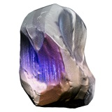
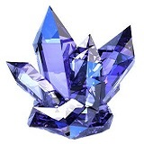
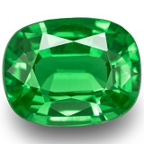
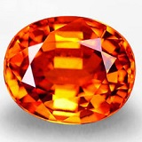

### unit-4-game
## CrystalsCollector

 

#### Development Tools Used
Tool | Use
---- | ---
Page Structure | HTML
Stylish, Responsive Styling | CSS
Logic | Javascript
HTML/Javascript Interaction | JQuery
Color Palette Selection | Coolors.co
Image Editing and Optimization | Pixlr
Code Validation | W3C
 

#### How the App Works
 * There will be four crystals displayed as buttons on the page.
 
 |    |    |    |    |

 * The player will be shown a random number at the start of the game.

 * When the player clicks on a crystal, it will add a specific amount of points to the player's total score. 

 * The player wins if their total score matches the random number from the beginning of the game.

 * The player loses if their score goes above the random number.

 * The game restarts whenever the player wins or loses.

 * When the game begins again, the player should see a new random number. Also, all the crystals will have four new hidden values. Of course, the user's score (and score counter) will reset to zero.

 * The app keeps track of the number of games the player wins and loses (until the game is refreshed, that is).
 
  
 
 #### Deployed Link:
 https://sandtr0ut.github.io/crystals-collector/
 
 See more projects at fordcrosby.com
